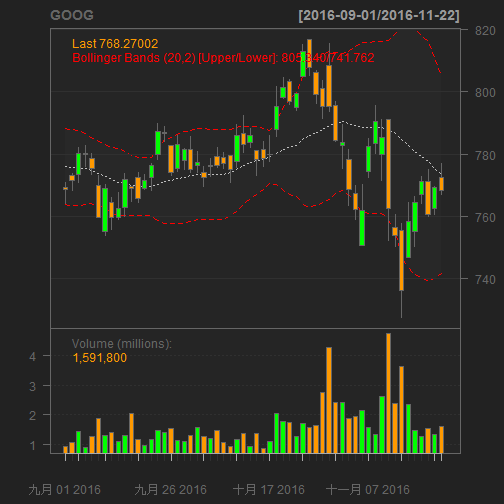

My Shiny App 
========================================================
title: Stock Price- Apple, Google and IBM
author: Edward Cheng
date: November 23, 2016


My Stock 
========================================================
I choose three stock codes:  is for Apple(AAPL), Google(GOOG) and IBM(IBM). 

All data have been collected from quantmod for 1 year. 

There are three programs: server.R, ui.R and myStock.R.

My stock address- https://aiedward.shinyapps.io/myShiny/

My stock funcion syntax
========================================================
Pre-Process function: 
Ensure what sotck code by user and what duration by user. 

```r
library('quantmod')

 
getData <- function(name, criteria) {
  if(name=='AAPL'){
    getSymbols('AAPL')
    chartSeries(AAPL, subset=criteria)
    addBBands()
  }else if(name=='GOOG'){
    getSymbols('GOOG')
    chartSeries(GOOG, subset=criteria)
    addBBands()
  }else if(name=='IBM'){
    getSymbols('IBM')
    chartSeries(IBM, subset=criteria)
    addBBands()
  }
}
```


My ui syntax
========================================================
Design the layout of my sock 

```r
library(shiny)

# Define UI for application that draws a plot
shinyUI(fluidPage(
  
  # Application title
  titlePanel("Stock Price- Apple, Google and IBM"),
  
  # Sidebar with a slider input for the mean, sd and obs
  sidebarLayout(
    sidebarPanel(
      
      br(),
      br(),
      
      p("If you cannot operate this app, please ensure libarary- quantmod- is in your R system; otherwise, please install it. "),
      
      ##Input filed for stock code
      selectInput(inputId = "stockcode",
                  label = "Stock Code:",
                  choices = c("Apple" = "AAPL", 
                              "Google" = "GOOG", 
                              "IBM" = "IBM")),
      ##Slide for duration
      sliderInput("duration",
                  "Duration (1-12 months):",
                  min = 1,
                  max = 12,
                  value = 1),
      
       ##Output the duration immediately
      p('Output duration'),
      textOutput('duration'),
      br(),
      
      p("Data are from ",
        a("quantmod", 
          href = "http://www.quantmod.com"))
      
      ),
    
    # Show a plot of the stock plot
    mainPanel(
      plotOutput("stockPlot")
    )
  )
))
```

<!--html_preserve--><div class="container-fluid">
<h2>Stock Price- Apple, Google and IBM</h2>
<div class="row">
<div class="col-sm-4">
<form class="well">
<br/>
<br/>
<p>If you cannot operate this app, please ensure libarary- quantmod- is in your R system; otherwise, please install it. </p>
<div class="form-group shiny-input-container">
<label class="control-label" for="stockcode">Stock Code:</label>
<div>
<select id="stockcode"><option value="AAPL" selected>Apple</option>
<option value="GOOG">Google</option>
<option value="IBM">IBM</option></select>
<script type="application/json" data-for="stockcode" data-nonempty="">{}</script>
</div>
</div>
<div class="form-group shiny-input-container">
<label class="control-label" for="duration">Duration (1-12 months):</label>
<input class="js-range-slider" id="duration" data-min="1" data-max="12" data-from="1" data-step="1" data-grid="true" data-grid-num="5.5" data-grid-snap="false" data-keyboard="true" data-keyboard-step="9.09090909090909" data-drag-interval="true" data-data-type="number" data-prettify-separator=","/>
</div>
<p>Output duration</p>
<div id="duration" class="shiny-text-output"></div>
<br/>
<p>
Data are from 
<a href="http://www.quantmod.com">quantmod</a>
</p>
</form>
</div>
<div class="col-sm-8">
<div id="stockPlot" class="shiny-plot-output" style="width: 100% ; height: 400px"></div>
</div>
</div>
</div><!--/html_preserve-->


My server syntax
========================================================
Call my stock program before runing the shinyServer. Excute the shineyServer and update the value of duration

```r
library(shiny)
library('quantmod')

source('./myStock.R')

shinyServer(
  
  function(input, output) {
        
    output$stockPlot <- renderPlot({
      
      # Extract input values
      stockcode <- input$stockcode
      duration  <- input$duration
      # combind the charaters and numbers. change number to the specific text
      durationc  <- paste0("last ",duration," months")
      merge  <- input$merge
      output$stockcode <- renderPrint(stockcode)
      output$duration <- renderPrint(durationc)
      output$merge <- renderPrint(merge)
      getData(stockcode,durationc)
    })
  })
```


Slide with Google lasting for 3 months
========================================================


```
[1] "GOOG"
```


